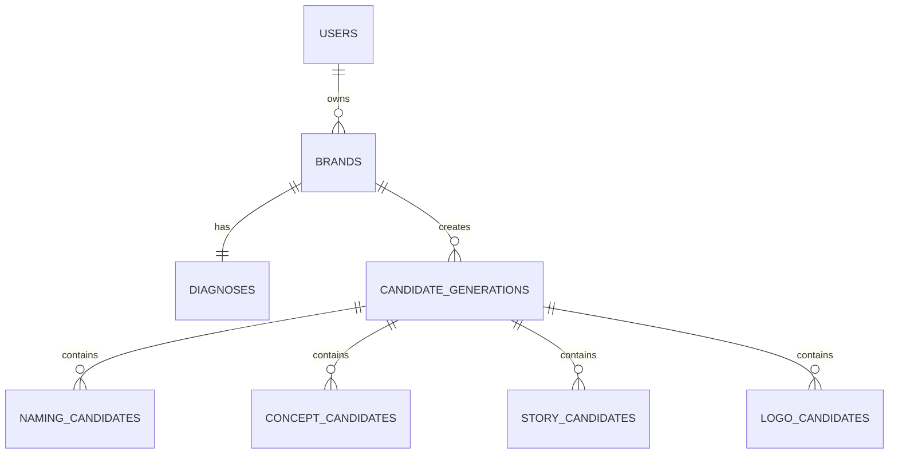

# BrandPilot Backend - ERD and Data Design

> 문서 역할: 테이블, 관계, 제약조건과 데이터 생명주기
>
> 상태: `ACTIVE_DESIGN`
>
> 기준 API: `API_SPEC.md 1.3.0`
>
> 최종 수정일: `2026-07-18`

이 문서는 BrandPilot의 데이터 계약만 관리합니다. 프로젝트 목적과 개발 방식은 `PROJECT_PLAN.md`, 현재 구현 진행률은 `PROJECT_STATE.md`, 외부 요청·응답 필드는 `API_SPEC.md`를 확인합니다.

ERDCloud에서 작성한 핵심 테이블을 Markdown으로 재현하고, Flyway migration을 작성하기 전에 컬럼·관계·제약조건을 검토하는 기준으로 사용합니다. 실제 적용된 스키마의 최종 기준은 버전 관리되는 Flyway SQL이며, 설계가 바뀌면 새 migration을 만들기 전에 이 문서를 먼저 갱신합니다.

## 1. 데이터 설계 원칙

- 핵심 도메인 데이터를 범용 JSON이나 `Map<String, Object>`로 저장하지 않습니다.
- 단계마다 필드가 다른 후보는 단계별 관계형 테이블로 분리합니다.
- 서비스 검증과 DB의 PK, FK, UNIQUE, NOT NULL, CHECK를 함께 사용합니다.
- 모든 관계는 자식 PK와 부모 PK를 분리하는 Non-Identifying Relationship을 사용합니다.
- Brand와 하위 데이터는 영구 삭제합니다.
- Flyway가 스키마를 만들고 Hibernate는 Entity와 스키마가 일치하는지만 검증합니다.
- 테이블명과 컬럼명은 `snake_case`, Java와 JSON 필드는 각각 Java 관례와 `camelCase`를 사용합니다.

## 2. 도메인과 생명주기

| 도메인 | 의미 | 소유·생명주기 |
| --- | --- | --- |
| User | 이메일로 로그인하는 사용자 | 여러 Brand를 소유 |
| Refresh Token | Access Token 재발급용 Opaque Token | User에 현재 토큰 해시와 만료시각 최대 하나 저장 |
| Brand | 진단부터 최종 로고까지 이어지는 브랜드 작업 | User에 종속 |
| Diagnosis | 진단 원본 답변과 처리 결과 | Brand당 하나 |
| Candidate Generation | 한 단계에서 한 번 생성한 후보 세 개의 묶음 | Brand·Stage별 최대 세 회 |
| Candidate | 단계별 생성 결과 또는 최종 선택 결과 | Generation에 종속 |
| Logo File | 로컬에 저장하는 로고 이미지 | Logo Candidate와 생명주기 공유 |

## 3. 논리 관계



각 Candidate Generation은 `stage`에 맞는 후보 테이블 하나에만 행을 가집니다. 예를 들어 `stage = NAMING`인 Generation에는 `naming_candidates`만 존재해야 합니다. 서로 다른 후보 테이블이 같은 Generation을 참조하지 못하게 하는 규칙은 일반 FK만으로 표현하기 어려우므로 Service 규칙과 테스트로 보장합니다.

## 4. users

회원가입, 로그인과 현재 Refresh Token을 저장합니다.

| 컬럼 | 타입 | Key | NULL | 설명 |
| --- | --- | --- | --- | --- |
| `user_id` | `BIGINT UNSIGNED` | PK, AI | NO | 사용자 식별자 |
| `email` | `VARCHAR(254)` | UK | NO | 소문자·공백 제거 후 저장하는 로그인 이메일 |
| `password_hash` | `VARCHAR(255)` |  | NO | BCrypt 비밀번호 해시 |
| `name` | `VARCHAR(50)` |  | NO | 앞뒤 공백을 제거한 사용자 이름 |
| `refresh_token_hash` | `VARCHAR(64)` | UK | YES | 현재 Opaque Refresh Token의 SHA-256 해시 |
| `refresh_token_expires_at` | `DATETIME(6)` |  | YES | 현재 Refresh Token 만료시각 |
| `created_at` | `DATETIME(6)` |  | NO | 가입 시각 |

제약조건:

- `uk_users_email (email)`
- `uk_users_refresh_token_hash (refresh_token_hash)`
- `refresh_token_hash`와 `refresh_token_expires_at`은 함께 NULL이거나 함께 존재하는 CHECK
- 비밀번호 평문은 어떤 컬럼에도 저장하지 않음

현재 V1 migration과 User Entity는 이 구조를 사용합니다.

### 인증 저장 결정

- 별도 `login_sessions`, `refresh_tokens` 테이블을 만들지 않습니다.
- 로그인·재발급 성공 시 User의 Refresh Token 해시와 만료시각을 교체합니다.
- 로그아웃 시 두 값을 NULL로 변경합니다.
- 현재 구조는 Refresh Token 하나만 보장하고, 이전 Access Token을 즉시 무효화하지 않습니다.
- 엄격한 단일 기기 로그인이 필요하면 JWT 구현 전에 `sid` 또는 `token_version` 저장과 요청별 검증으로 설계를 변경해야 합니다.

## 5. brands

한 번의 진단부터 최종 결과까지 이어지는 브랜드 작업의 진행 상태를 저장합니다.

| 컬럼 | 타입 | Key | NULL | 설명 |
| --- | --- | --- | --- | --- |
| `brand_id` | `BIGINT UNSIGNED` | PK, AI | NO | Brand 식별자 |
| `user_id` | `BIGINT UNSIGNED` | FK | NO | 소유 User |
| `current_step` | `VARCHAR(20)` |  | NO | `NAMING`, `CONCEPT`, `STORY`, `LOGO`, `FINAL` |
| `status` | `VARCHAR(20)` |  | NO | `IN_PROGRESS`, `COMPLETED` |
| `version` | `BIGINT` |  | NO | 낙관적 락 버전 |
| `created_at` | `DATETIME(6)` |  | NO | 생성 시각 |
| `updated_at` | `DATETIME(6)` |  | NO | 마지막 변경 시각 |
| `completed_at` | `DATETIME(6)` |  | YES | FINAL 완료 시각 |

관계:

- `users ||--o{ brands`
- `brands.user_id → users.user_id`
- Non-Identifying Relationship
- User 삭제 API가 현재 범위에 없으므로 User 삭제 시 FK 동작은 구현 전 최종 결정합니다.

불변식:

- 진단 제출이 성공할 때 Brand와 Diagnosis를 같은 유스케이스에서 생성합니다.
- `current_step = FINAL`이면 `status = COMPLETED`, `completed_at`이 존재해야 합니다.
- 완료 전에는 `status = IN_PROGRESS`입니다.
- `version`으로 동시에 들어온 상태 변경의 Lost Update를 감지합니다.

권장 인덱스:

- `idx_brands_user_id (user_id)` — 내 브랜드 목록 조회

## 6. diagnoses

진단 요청 원본과 처리 결과를 저장합니다.

| 컬럼 | 타입 | Key | NULL | 설명 |
| --- | --- | --- | --- | --- |
| `diagnosis_id` | `BIGINT UNSIGNED` | PK, AI | NO | Diagnosis 식별자 |
| `brand_id` | `BIGINT UNSIGNED` | FK, UK | NO | 대상 Brand, Brand당 하나 |
| `industry` | `VARCHAR(100)` |  | NO | 업종 |
| `business_description` | `VARCHAR(1000)` |  | NO | 사업 설명 |
| `target_customer` | `VARCHAR(500)` |  | NO | 대상 고객 |
| `customer_problem` | `VARCHAR(1000)` |  | NO | 해결할 고객 문제 |
| `differentiation` | `VARCHAR(1000)` |  | NO | 차별점 |
| `desired_image` | `VARCHAR(500)` |  | NO | 희망 브랜드 이미지 |
| `summary` | `VARCHAR(500)` |  | NO | Fake 진단 처리 요약 |
| `created_at` | `DATETIME(6)` |  | NO | 생성 시각 |

관계와 삭제:

- `brands ||--|| diagnoses`
- `diagnoses.brand_id → brands.brand_id`
- Non-Identifying Relationship
- `brand_id` UNIQUE로 Brand당 Diagnosis 하나 보장
- Brand 영구 삭제 시 Diagnosis도 삭제

복수 `coreValues`, `keywords`의 저장 구조는 아직 결정하지 않았습니다.

## 7. candidate_generations

한 단계에서 후보 세 개를 생성한 한 회차와 그 상태를 저장합니다.

| 컬럼 | 타입 | Key | NULL | 설명 |
| --- | --- | --- | --- | --- |
| `generation_id` | `BIGINT UNSIGNED` | PK, AI | NO | 생성 회차 식별자 |
| `brand_id` | `BIGINT UNSIGNED` | FK | NO | 대상 Brand |
| `stage` | `VARCHAR(20)` |  | NO | `NAMING`, `CONCEPT`, `STORY`, `LOGO` |
| `generation_number` | `TINYINT UNSIGNED` |  | NO | 단계별 1~3회 |
| `status` | `VARCHAR(20)` |  | NO | `ACTIVE`, `SUPERSEDED`, `SELECTED` |
| `generated_at` | `DATETIME(6)` |  | NO | 생성 시각 |
| `updated_at` | `DATETIME(6)` |  | NO | 상태 변경 시각 |

제약조건과 인덱스:

- UNIQUE `(brand_id, stage, generation_number)`
- CHECK `generation_number BETWEEN 1 AND 3`
- 인덱스 `(brand_id, stage, status)` — 현재 단계의 활성·선택 Generation 조회
- `candidate_generations.brand_id → brands.brand_id`
- Brand 영구 삭제 시 Generation 삭제

생명주기:

- 최신 생성 회차는 `ACTIVE`이고 후보 세 개가 존재합니다.
- 재생성하면 이전 Generation을 `SUPERSEDED`로 변경하고 이전 후보 행과 로고 파일을 삭제합니다.
- 선택하면 Generation을 `SELECTED`로 변경하고 선택 후보 하나만 남깁니다.
- Generation 메타데이터는 회차 제한과 이력 확인을 위해 유지합니다.

## 8. naming_candidates

| 컬럼 | 타입 | Key | NULL | 설명 |
| --- | --- | --- | --- | --- |
| `candidate_id` | `BIGINT UNSIGNED` | PK, AI | NO | 네이밍 후보 식별자 |
| `generation_id` | `BIGINT UNSIGNED` | FK | NO | NAMING Generation |
| `display_order` | `TINYINT UNSIGNED` |  | NO | 응답 순서 1~3 |
| `name` | `VARCHAR(100)` |  | NO | 브랜드 이름 후보 |
| `rationale` | `VARCHAR(500)` |  | NO | 후보 생성 이유 |
| `selected_at` | `DATETIME(6)` |  | YES | 최종 선택 시각 |

제약조건:

- UNIQUE `(generation_id, display_order)`
- CHECK `display_order BETWEEN 1 AND 3`
- Generation 삭제 시 후보 삭제

## 9. concept_candidates

| 컬럼 | 타입 | Key | NULL | 설명 |
| --- | --- | --- | --- | --- |
| `candidate_id` | `BIGINT UNSIGNED` | PK, AI | NO | 콘셉트 후보 식별자 |
| `generation_id` | `BIGINT UNSIGNED` | FK | NO | CONCEPT Generation |
| `display_order` | `TINYINT UNSIGNED` |  | NO | 응답 순서 1~3 |
| `title` | `VARCHAR(100)` |  | NO | 콘셉트 제목 |
| `statement` | `VARCHAR(500)` |  | NO | 콘셉트 설명 |
| `rationale` | `VARCHAR(500)` |  | NO | 후보 생성 이유 |
| `selected_at` | `DATETIME(6)` |  | YES | 최종 선택 시각 |

제약조건:

- UNIQUE `(generation_id, display_order)`
- CHECK `display_order BETWEEN 1 AND 3`
- Generation 삭제 시 후보 삭제

복수 `brandValues`의 저장 구조는 아직 결정하지 않았습니다.

## 10. story_candidates

| 컬럼 | 타입 | Key | NULL | 설명 |
| --- | --- | --- | --- | --- |
| `candidate_id` | `BIGINT UNSIGNED` | PK, AI | NO | 스토리 후보 식별자 |
| `generation_id` | `BIGINT UNSIGNED` | FK | NO | STORY Generation |
| `display_order` | `TINYINT UNSIGNED` |  | NO | 응답 순서 1~3 |
| `title` | `VARCHAR(200)` |  | NO | 스토리 제목 |
| `story_text` | `TEXT` |  | NO | 스토리 본문 |
| `rationale` | `VARCHAR(500)` |  | NO | 후보 생성 이유 |
| `selected_at` | `DATETIME(6)` |  | YES | 최종 선택 시각 |

제약조건:

- UNIQUE `(generation_id, display_order)`
- CHECK `display_order BETWEEN 1 AND 3`
- Generation 삭제 시 후보 삭제

복수 `emotionalTones`의 저장 구조는 아직 결정하지 않았습니다.

## 11. logo_candidates

로고 후보의 DB 메타데이터를 저장하며 실제 이미지는 로컬 파일 저장소에 둡니다.

| 컬럼 | 타입 | Key | NULL | 설명 |
| --- | --- | --- | --- | --- |
| `candidate_id` | `BIGINT UNSIGNED` | PK, AI | NO | 로고 후보 식별자 |
| `generation_id` | `BIGINT UNSIGNED` | FK | NO | LOGO Generation |
| `display_order` | `TINYINT UNSIGNED` |  | NO | 응답 순서 1~3 |
| `stored_path` | `VARCHAR(500)` |  | NO | 외부에 직접 노출하지 않는 내부 저장 경로 |
| `content_type` | `VARCHAR(100)` |  | NO | 검증된 MIME Type |
| `file_size` | `BIGINT UNSIGNED` |  | NO | 파일 크기(byte) |
| `logo_concept` | `VARCHAR(500)` |  | NO | 로고 콘셉트 설명 |
| `rationale` | `VARCHAR(500)` |  | NO | 후보 생성 이유 |
| `selected_at` | `DATETIME(6)` |  | YES | 최종 선택 시각 |

제약조건:

- UNIQUE `(generation_id, display_order)`
- CHECK `display_order BETWEEN 1 AND 3`
- Generation 삭제 시 후보 메타데이터 삭제

DB 트랜잭션은 로컬 파일 시스템을 롤백할 수 없으므로 파일 생성 후 DB 저장 실패, 후보 재생성, 선택과 Brand 삭제에서 보상 삭제 또는 재시도 정책이 필요합니다.

## 12. 브랜드 상태 전이와 불변식

```text
진단 제출 성공
→ NAMING
→ CONCEPT
→ STORY
→ LOGO
→ FINAL
```

1. Brand는 반드시 한 User에 속합니다.
2. 생성된 Brand에는 Diagnosis가 정확히 하나 존재해야 합니다.
3. 현재 단계의 후보만 생성·조회·선택할 수 있습니다.
4. 이전 단계가 선택되어야 다음 단계로 이동할 수 있습니다.
5. 단계별 Generation은 최대 세 회입니다.
6. `ACTIVE` Generation에는 후보가 정확히 세 개 존재해야 합니다.
7. 선택 후보는 같은 Brand·Stage의 최신 `ACTIVE` Generation에 속해야 합니다.
8. 완료한 단계의 선택 결과는 변경할 수 없습니다.
9. `SELECTED` Generation에는 선택 후보 하나만 남깁니다.
10. `SUPERSEDED` Generation에는 후보 내용을 남기지 않습니다.
11. `COMPLETED` Brand에는 네 단계의 선택 결과가 모두 존재해야 합니다.
12. Brand 삭제 시 Diagnosis, Generation, Candidate와 로고 파일을 함께 제거합니다.

행 개수를 포함하는 “후보 정확히 세 개”와 Stage에 맞는 후보 테이블 같은 규칙은 일반 CHECK 제약만으로 완전히 보장하기 어렵습니다. 트랜잭션 단위 Service 로직과 통합 테스트로 함께 보호합니다.

## 13. API와 데이터 출처

| API 영역 | 주요 테이블 |
| --- | --- |
| 회원가입·로그인·토큰 | `users` |
| 진단 제출과 Brand 생성 | `brands`, `diagnoses` |
| 내 Brand 조회 | `brands` |
| 단계별 후보 생성·조회 | `brands`, `candidate_generations`, 해당 후보 테이블 |
| 단계별 선택 | `brands`, `candidate_generations`, 해당 후보 테이블 |
| 로고 이미지 조회 | `brands`, `candidate_generations`, `logo_candidates`와 로컬 파일 |
| 최종 결과 | `brands`와 네 단계의 선택 후보 |
| Brand 영구 삭제 | Brand의 모든 하위 테이블과 로컬 파일 |

## 14. 구현 전 결정이 남은 항목

- 엄격한 단일 기기 로그인에 필요한 `sid` 또는 `token_version` 도입 여부
- Diagnosis의 `coreValues`, `keywords` 저장 방식
- Concept의 `brandValues` 저장 방식
- Story의 `emotionalTones` 저장 방식
- User와 Brand 사이의 FK 삭제 정책
- 후보 선택·재생성의 최종 동시성 제어와 인덱스
- 로고 파일 삭제 실패의 재시도·보상 방식
- users 이외 시간 컬럼의 생성·수정 책임을 DB와 JPA 중 어디에 둘지

결정하지 않은 항목을 구현 시 임의로 채우지 않습니다. 관련 기능을 시작하기 전에 사용자와 선택지·트레이드오프를 확인하고, 결정 후 이 문서와 필요한 API 계약을 함께 갱신합니다.
